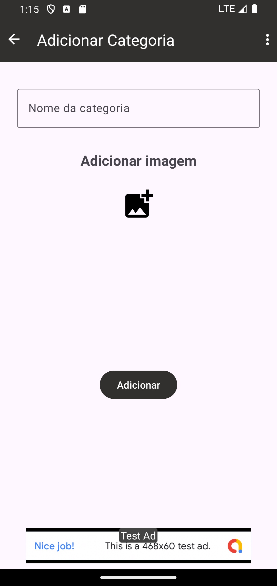

<h1 align="center">Projeto Firebase</h1>

<p align="center">
  <a href="https://opensource.org/licenses/Apache-2.0"></a>
  <a href="https://android-arsenal.com/api?level=26"></a>
  <br>
  <a href="https://wa.me/+5547984252271"></a>
  <a href="mailto:rubensfb1985@gmail.com"></a>
</p>

<p align="center">  

⭐ Esse é um projeto para demonstrar meu conhecimento técnico no desenvolvimento Android nativo com Kotlin. Mais informações técnicas abaixo.

Projeto simulando um aplicativo de vendas focado em fornecedores, com opção de adicionar categorias e produtos, listando os mesmos. 

</p>

</br>

<p float="left" align="center">
  
  
  
  
  
  
   
   </p>

## Download

Faça o download da <a href="apk/app-debug.apk?raw=true">APK diretamente</a>. Você pode ver <a href="https://www.google.com/search?q=como+instalar+um+apk+no+android">aqui</a> como instalar uma APK no seu aparelho android.

## Tecnologias usadas e bibliotecas de código aberto

- Minimum SDK level 26
- [Linguagem Kotlin](https://kotlinlang.org/)

- Jetpack
  - Lifecycle: Observe os ciclos de vida do Android e manipule os estados da interface do usuário após as alterações do ciclo de vida.
  - ViewModel: Gerencia o detentor de dados relacionados à interface do usuário e o ciclo de vida. Permite que os dados sobrevivam a alterações de configuração, como rotações de tela.
  - ViewBinding: Liga os componentes do XML no Kotlin através de uma classe que garante segurança de tipo e outras vantagens.
  - Custom Views: View customizadas feitas do zero usando XML.
  - Navigation: Gerencie links diretos e navegue entre telas.
  - Recyclerview: Mostre grandes conjuntos de dados na IU enquanto minimiza o uso de memória.

- Arquitetura
  - MVVM (Model - View - ViewModel) com Clean Architecture
  - Comunicação da ViewModel com a View através de LiveData
  - Repositories para abstração da comunidação com a camada de dados.
  
- Bibliotecas - LISTE TODAS AS BIBLIOTECAS USADAS NO PROJETO, COM LINK E DESCRIÇÃO BREVE DO QUE ELA FAZ
  - [Dagger Hilt](https://developer.android.com/training/dependency-injection/hilt-android?hl=pt-br) : Para fazer injeção de dependências que reduz o código boilerplate.
  - [Firebase Authentication](https://firebase.google.com/products/auth?hl=pt) : Login simples em qualquer plataforma.
  - [Firebase Cloud Storage](https://firebase.google.com/products/storage?hl=pt) : Armazena fotos e vídeos dos usuários .
  - [Firebase Cloud Firestore](https://firebase.google.com/products/firestore?hl=pt) : Banco de dados NoSQL para apps globais.
  - [Picasso](https://github.com/square/picasso): Para carregamento de imagens e cacheamento das mesmas.
 
## Arquitetura
**Projeto Firebase** utiliza a arquitetura MVVM com Clean Architecture e o padrão de Repositories, que segue as [recomendações oficiais do Google](https://developer.android.com/topic/architecture).
</br></br>
 
<br>

## Features

### Feature 1


Sistema de login usando Firebase Authentication.

### Feature 2


Lista dos itens e navegação entre os mesmos.

### Feature 2


Opções de inserir, atualizar ou deletar itens.

# Licença

```xml

Licensed under the Apache License, Version 2.0 (the "License");
you may not use this file except in compliance with the License.
You may obtain a copy of the License at

   http://www.apache.org/licenses/LICENSE-2.0

Unless required by applicable law or agreed to in writing, software
distributed under the License is distributed on an "AS IS" BASIS,
WITHOUT WARRANTIES OR CONDITIONS OF ANY KIND, either express or implied.
See the License for the specific language governing permissions and
limitations under the License.

```
Google Play e o logótipo do Google Play são marcas comerciais da Google LLC.
